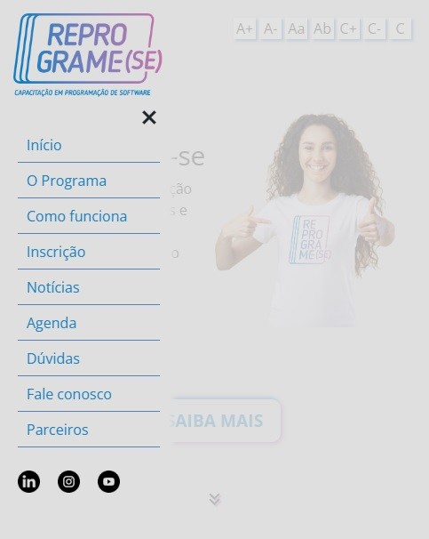

# Primeiro Hackathon do Reprograme-se

Os alunos foram dividios em duplas com objetivo de desenvolver um novo web site para o <a href="https://reprograme-se.org.br/" target="_blank">Reprograme-se</a> que é um programa desenvolvido pela IFES e pela Action (Associação Capixaba de Tecnologia).
 
## Equipe "Codando o Futuro"

- Vinícius Sobreira: <a href="https://github.com/SobreiraV" target="_blank">GitHub</a> - <a href="https://www.linkedin.com/in/viniciussobreira/" target="_blank">Linkedin</a>
- Samanta Cristina: <a href="https://github.com/sammyhup" target="_blank">GitHub</a> - <a href="https://www.linkedin.com/in/samanta-cristina-23802143/" target="_blank">Linkedin</a>

## Requisitos
  1. O site deve ter um design e layout intuitivos que permitam aos usuários navegar facilmente;
  2. O site deve ser responsivo e compatível com os principais navegadores e resoluções de tela;
  3. O site deve ser desenvolvido usando HTML, CSS e JavaScript, podendo ou não utilizar Bootstrap;
  4. O site deve respeitar a identidade visual do Reprograme-se, utilizando a paleta de cores e  logos presentes na pasta /assets do código base disponível no Repl.it;
  5. O site deve ter uma área de notícias. Cada notícia terá uma foto de capa, um título, conteúdo textual, data e horário de publicação. Crie alguns exemplos de notícias;
  6. O site deve ter uma área de calendário e eventos, evidenciando as datas importantes;
  7. O site deve ter uma área de depoimentos de alunos do Reprograme-se. Cada depoimento deverá conter alguma identificação do aluno e seu relato;
  8. O site deve ter uma área de dúvidas frequentes (FAQ);
  9. O site deve ter um formulário de contato em que o usuário poderá enviar dúvidas, sugestões, reclamações ou outros assuntos;
  10. O site deve ter uma área em destaque para novos alunos se inscreverem no curso;
  11. O site deve ter uma área em que sejam disponibilizadas informações sobre o curso, evidenciando a grade currícular;
  12. O site deve ter uma área em que sejam destacadas informações sobre o Ifes e a Action, instituições responsáveis pela realização do programa;
  13. O site deverá contar com recursos de acessibilidade.
  14. Dentre as funcionalidades relacionadas à acessibilidade, você deverá desenvolver uma barra de navegação com as seguintes funcionalidades:
  
  - Aumento do tamanho da fonte;
  - Redução do tamanho da fonte;
  - Ativação/Desativação de modo alto contraste;

  As preferências do usuário em relação às funcionalidades de acessibilidade deverão ser armazenadas na Localstorage, permitindo que, em futuros acessos, tais configurações já sejam carregadas automaticamente;

  Além das funcionalidades elencadas, a equipe deverá propor outras funcionalidades e conteúdos para o site; 

  A equipe poderá seguir a sugestão de árvore de diretórios para organização dos arquivos html, css, js e outros;

## Funcionamento

**Página desktop**

**Página mobile**
 

## Entrega

- Definimos que o site principal seria de página única e que teríamos páginas suplementares para conteúdos específicos, dessa forma não sobrecarregamos a navegação prejudicando a experiência do usuário.
- Criamos arquivos CSS para cada seção do site, facilitando assim o desenvolvimento e manutenção.
- Estabelecemos as cores bases para o projeto, mantendo as cores do Reprograme-se indicadas como principais e utilizando as ferramentas de seleção de cores chegamos a duas variações diferentes de cor para o fundo, uma escura e uma clara. Optamos pela cor clara pois ela passa uma ideia de leveza para página e é suave aos olhos para ser amigável aos interessados.
- Além das opções de acessibilidade do requisito, adicionamos opção de fonte para disléxicos.
- Consideramos que atendemos aos requisitos de acordo como enxergamos eles. Mas tínhamos mais ideias para deixar a página mais bonita e dinâmica, considerando o limite de tempo do projeto e nossos limites de tempo pessoais acreditamos que fizemos um bom trabalho para nossa primeira experiência.

## Competências desenvolvidas

HTML5 | CSS3 | JavaScript | Bootstrap | Trabalho em equipe | GitHub Merge
